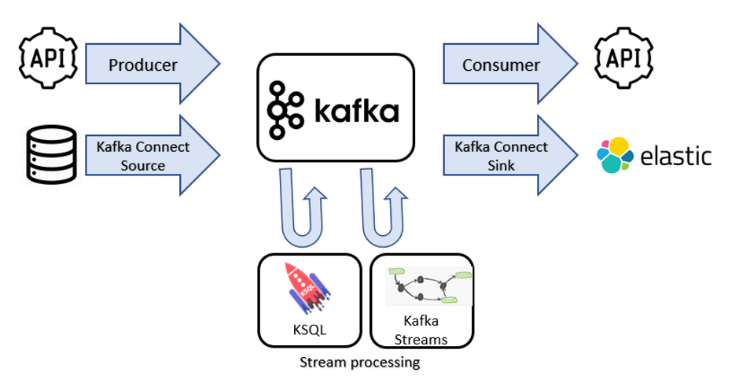
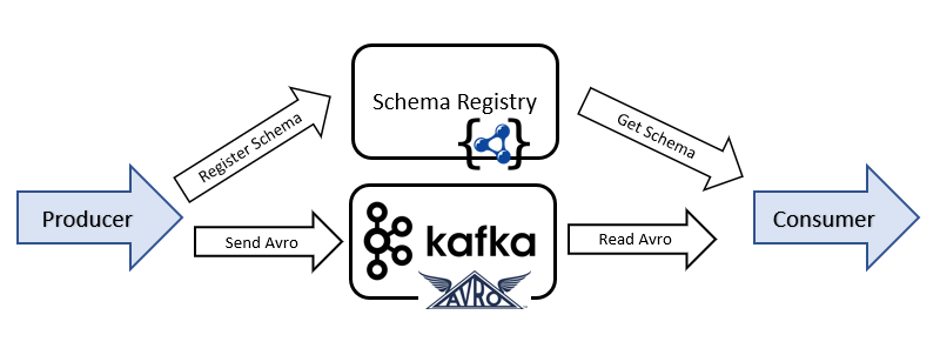

# Get started

## Prerequisites & setup

- install docker/docker-compose
- set your Docker maximum memory to something really big, such as 10GB. (preferences -> advanced -> memory)
- clone this repo!

```console
mkdir ~/git
cd ~/git
git clone https://github.com/saubury/tw-eda-kafka.git
cd tw-eda-kafka
```

## How you'll work
You'll need _three_ terminals for these exercises. Each one you should `cd ~/git/tw-eda-kafka`

For simplicity arrange your three terminals so you can see the first and second at the same time (perhaps split horizontally if you're using iTerm2) Something like below.


## Docker Startup
**Terminal 1**
```console
docker-compose up -d 
```


# Basic Producers and Consumers



**Terminal 1**
```
docker-compose exec kafka-connect bash
```

Create a topic
```
kafka-topics --bootstrap-server kafka:29092 --create --partitions 1 --replication-factor 1 --topic MYTOPIC
```

Check it's there 
```
kafka-topics --list --bootstrap-server kafka:29092
```

*Create a Producer*

Write some text from STDIN

```
kafka-console-producer --broker-list kafka:29092 --topic MYTOPIC
```

Now type some things into first (original) terminal (and press ENTER).  


**Terminal 2**

*Create a Consumer*

Start another terminal
```
docker-compose exec kafka-connect bash
```

In the newly created (second) terminal let's start reading from new Kafka topic
```
kafka-console-consumer --bootstrap-server kafka:29092 --topic MYTOPIC --from-beginning
```
Each line you type in the first terminal should appear in second terminal

What have we learnt?  It's easy to be a producer or consumer.  Out of the box Kafka doesn't care what you're writing - it's just a bunch of bytes

# Structured Data with AVRO





**Terminal 1**

At UNIX prompt, (Note: Press Ctrl C to exit the producer script)
```
kafka-topics --bootstrap-server kafka:29092 --create --partitions 1 --replication-factor 1 --topic COMPLAINTS_AVRO

kafka-avro-console-producer  --broker-list kafka:29092 --property schema.registry.url="http://schema-registry:8081"  --topic COMPLAINTS_AVRO \
--property value.schema='
{
  "type": "record",
  "name": "myrecord",
  "fields": [
      {"name": "customer_name",  "type": "string" }
    , {"name": "complaint_type", "type": "string" }
    , {"name": "trip_cost", "type": "float" }
    , {"name": "new_customer", "type": "boolean"}
  ]
}' << EOF
{"customer_name":"Carol", "complaint_type":"Late arrival", "trip_cost": 19.60, "new_customer": false}
EOF
```

**Terminal 2**

Press Ctrl+C and Ctrl+D and run the following curl command.

BTW, this is AVRO

```
curl -s -X GET http://localhost:8081/subjects/COMPLAINTS_AVRO-value/versions/1
```

## AVRO Schema Evolution
Let's add a loyality concept to our complaints topic - we'll add "number_of_rides" to the payload

**Terminal 1** 

```
kafka-avro-console-producer  --broker-list kafka:29092 --property schema.registry.url="http://schema-registry:8081"  --topic COMPLAINTS_AVRO \
--property value.schema='
{
  "type": "record",
  "name": "myrecord",
  "fields": [
      {"name": "customer_name",  "type": "string" }
    , {"name": "complaint_type", "type": "string" }
    , {"name": "trip_cost", "type": "float" }
    , {"name": "new_customer", "type": "boolean"}
    , {"name": "number_of_rides", "type": "int", "default" : 1}
  ]
}' << EOF
{"customer_name":"Ed", "complaint_type":"Dirty car", "trip_cost": 29.10, "new_customer": false, "number_of_rides": 22}
EOF
```

**Terminal 2**

Let's see what schemas we have registered now
```
curl -s -X GET http://localhost:8081/subjects/COMPLAINTS_AVRO-value/versions

curl -s -X GET http://localhost:8081/subjects/COMPLAINTS_AVRO-value/versions/1 | jq '.'

curl -s -X GET http://localhost:8081/subjects/COMPLAINTS_AVRO-value/versions/2 | jq '.'

or you can also use:

curl -s -X GET http://localhost:8081/subjects/COMPLAINTS_AVRO-value/versions/2 | jq -r .schema | jq .

```

# Kafka Connect
Let's copy data from an upstream database which has a list of ride users.  Connecting Kafka to and from other systems (such as a database or object store) is a very common task.  The Kafka Connect framework has a plug in archecture which allows you to _source_ from an upstream system or _sink_ into a downstream system.  

## Setup Postgres source database

**in Terminal 1:** 

Exit the kafka-connect container by pressing Ctrl+D.

```
cat scripts/postgres-setup.sql

docker-compose exec postgres psql -U postgres -f /scripts/postgres-setup.sql
```

To look at the Postgres table
```
docker-compose exec postgres psql -U postgres -c "select * from users;"
```


## Kafka Connect Setup
Our goal now is to source data continuously from our Postgres database and produce into Kafka.  We'll use Kafka connect as the framework, and a JDBC Postgres Source connector coto connect to the database


Have a look at `scripts/connect_source_postgres.json`

Load connect config
```
curl -k -s -S -X PUT -H "Accept: application/json" -H "Content-Type: application/json" --data @./scripts/connect_source_postgres.json http://localhost:8083/connectors/src_pg/config
```

```
curl -s -X GET http://localhost:8083/connectors/src_pg/status | jq '.'
```

**Terminal 2**

Now let's consume the topic by starting a consumer inside the kafka-connect container to 

```
kafka-avro-console-consumer --bootstrap-server kafka:29092 --topic db-users --from-beginning --property  schema.registry.url="http://schema-registry:8081"
```

**Terminal 1**

Insert a new database row into Postgres
```
docker exec -it postgres psql -U postgres -c "INSERT INTO users (userid, username) VALUES ('J', 'Jane');"
```
You _should_ see Jane arrive automatically into the Kafka topic


# Generate ride request data
Create a stream of rider requests

**Terminal 3**
```
docker-compose exec ksql-datagen ksql-datagen schema=/scripts/riderequest.avro  format=avro topic=riderequest key=rideid maxInterval=5000 iterations=1000 bootstrap-server=kafka:29092 schemaRegistryUrl=http://schema-registry:8081 value-format=avro
```

In Terminal 2, (Exit the existing consumer by pressing Ctrl+C) 
Check the AVRO output of the `riderequest` topic. Press ^C when you've seen a few records.

```
kafka-avro-console-consumer --bootstrap-server kafka:29092 --topic riderequest --from-beginning --property  schema.registry.url="http://schema-registry:8081"
```

# Build a stream processor
We have a constant steam of rider requests arriving in the `riderequest` topic.  But each request has only a `userid` (such as `J`) and no name (like `Jane`).  Also, the rider location has seperate latitide and longtitude fields; we want to be able to join them together as single string field (to form a geom - `cast(rr.LATITUDE as varchar) || ',' || cast(rr.LONGITUDE as varchar)`)

Let's build a stream processor to consume from the `riderequest` topic and `db-users` topics, join them and produce into a new topic along with a new location attribute.  

Will build our stream processor in ksql.

## ksqlDB CLI
Build a stream processor 

**Terminal 2**

```
docker-compose exec ksql-cli ksql http://ksql-server:8088
```

Run the KSQL script: 

```
ksql
ksql> run script '/scripts/join_topics.ksql';
exit;

```

And if you want to check

**Terminal 1** from inside the Kafka-connect container
```
kafka-console-consumer --bootstrap-server kafka:29092 --topic RIDESANDUSERSJSON
```

# Sink to Elastic/Kibana
Setup dynamic elastic templates

**Terminal 2**

At the console prompt

```
./scripts/load_elastic_dynamic_template
```

Now we need a sink connector to read from the topic RIDESANDUSERSJSON

Load connect config.
```
curl -k -s -S -X PUT -H "Accept: application/json" -H "Content-Type: application/json" --data @./scripts/connect_sink_elastic.json http://localhost:8083/connectors/sink_elastic/config
```

```
curl -s -X GET http://localhost:8083/connectors/sink_elastic/status | jq '.'
```

## Kibana Dashboard Import

- Navigate to http://localhost:5601/app/kibana#/management/kibana/objects
- Click Import
- Select file 06_kibana_export.json
- Click Automatically overwrite all saved objects? and select Yes, overwrite all objects
- Kibana - Open Dashboard
- Open http://localhost:5601/app/kibana#/dashboards


