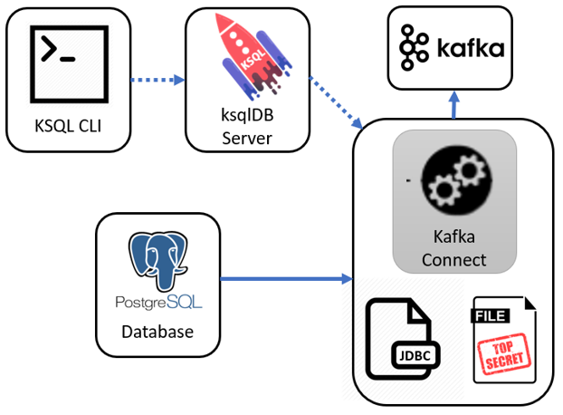

# Get started

## Prerequisites & setup
- clone this repo!
- install docker/docker-compose
- set your Docker maximum memory to something really big, such as 10GB. (preferences -> advanced -> memory)

## Docker Startup
```
docker-compose -f docker-compose.yml  -d
```


## Manual Kafka Connect Setup

Load connect config
```
curl -k -s -S -X PUT -H "Accept: application/json" -H "Content-Type: application/json" --data @./10_source_postgres.json http://localhost:8083/connectors/01_source_postgres/config
```

```
curl -s -X GET http://localhost:8083/connectors/01_source_postgres/status | jq '.'
```


# Create topics
```
cd scripts
./02_create_topic
```

# KSQL

Get a KSQL CLI session:
```
docker exec -it ksql-cli bash -c 'echo -e "\n\n⏳ Waiting for KSQL to be available before launching CLI\n"; while : ; do curl_status=$(curl -s -o /dev/null -w %{http_code} http://ksql-server:8088/info) ; echo -e $(date) " KSQL server listener HTTP state: " $curl_status " (waiting for 200)" ; if [ $curl_status -eq 200 ] ; then  break ; fi ; sleep 5 ; done ; ksql http://ksql-server:8088'
```


Check connector status:

```
curl -s "http://localhost:8083/connectors?expand=info&expand=status" | \
         jq '. | to_entries[] | [ .value.info.type, .key, .value.status.connector.state,.value.status.tasks[].state,.value.info.config."connector.class"]|join(":|:")' | \
         column -s : -t| sed 's/\"//g'| sort
```

# Kafka Connect with ksqlDB 
How to setup Kafka Connect with ksqlDB .. and externalizing secrets





## Startup this project

```
docker-compose up -d
```

## Setup database

```
cat postgres-setup.sql

docker-compose exec postgres psql -U postgres -f /postgres-setup.sql
```

To look at the Postgres table
```
docker-compose exec postgres psql -U postgres -c "select * from socks;"
```


## ksqlDB CLI
```
docker-compose exec ksql-cli ksql http://ksql-server:8088
```


## Bad
Please **don't** do this - the password is obvious

```
CREATE SOURCE CONNECTOR `postgres-jdbc-source` WITH(
  "connector.class"='io.confluent.connect.jdbc.JdbcSourceConnector',
  "connection.url"='jdbc:postgresql://postgres:5432/postgres',
  "mode"='incrementing',
  "incrementing.column.name"='ref',
  "table.whitelist"='socks',
  "connection.user"='postgres',
  "connection.password"='Sup3rS3c3t',
  "topic.prefix"='db-',
  "key"='sockname');
```

# Better
Create a _secrets_ file like `credentials.properties` this
```
PG_URI=jdbc:postgresql://postgres:5432/postgres
PG_USER=postgres
PG_PASS=Sup3rS3c3t
```
And then you can concentrate on defining your configuratin like this

```
CREATE SOURCE CONNECTOR `postgres-jdbc-source` WITH(
  "connector.class"='io.confluent.connect.jdbc.JdbcSourceConnector',
  "connection.url"='${file:/scripts/credentials.properties:PG_URI}',
  "mode"='incrementing',
  "incrementing.column.name"='ref',
  "table.whitelist"='socks',
  "connection.user"='${file:/scripts/credentials.properties:PG_USER}',
  "connection.password"='${file:/scripts/credentials.properties:PG_PASS}',
  "topic.prefix"='db-',
  "key"='sockname');
```

## Check it
From ksqlDB run this

```
docker-compose exec ksql-cli ksql http://ksql-server:8088

print 'db-socks' from beginning;
```

And you should see this
```
{"sockname": "Black wool socks", "ref": 1}
{"sockname": "Yellow colourful socks", "ref": 2}
{"sockname": "Old brown socks", "ref": 3}
```

In another window, insert a new database row
```
docker exec -it postgres psql -U postgres -c "INSERT INTO socks (sockname) VALUES ('Mismatched socks');"
```

And your ksqlDB should quickly show one additional row
```
{"sockname": "Mismatched socks", "ref": 4}
```
